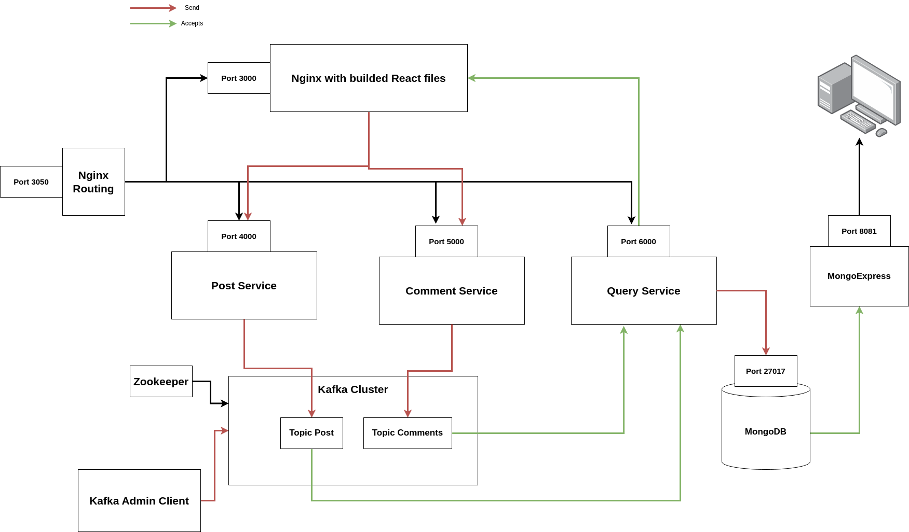

# Blog app microservices 

This is a small application in microservices. A user can create a post and other users can comment.

Initial goal is create the logic of microservices and after host 
in Kubernetes. If you want to see how I deploy the application in Kubernetes with Terraform in GCP the follow the link https://github.com/AposLaz/Terraform/tree/main/kubernetes-cluster/gke.

## Build With

<p>
  
  
  
  
  
  
  
  
  
  
</p>

## Architecture




## Project Structure

```bash
blog-microservices/
├── client/
├── nginx/
├── comments/
├── posts/
├── query-posts-service/
├── kafka/
├── files/  ## images etc.
├── k8s-yamls/ ## for Kubernetes
└── README.md
```

For every service created a specific image in docker hub. Expect **nginx**.
There is a ```.env``` file where exist all configuration for ports, hosts etc. Use your specific values or let defaults.

If you want to learn more about application read the [Documentation](#documentation) below

## Getting Started

### Production

1. Clone repository	
    ```bash
	$ git clone https://github.com/AposLaz/Blog-microservices.git
		
	$ cd Blog-microservices

	# Remove current origin repo
	$ git remote remove origin  
    ```
2. Start Application using Docker :whale2: https://www.docker.com/

    ```bash
    $ docker-compose up -d

    # wait 30seconds
    ```
3. Open **http://localhost:3050/** on broswer and create your posts.

### Development

1. Clone repository	
    ```bash
	$ git clone https://github.com/AposLaz/Blog-microservices.git
		
	$ cd Blog-microservices

	# Remove current origin repo
	$ git remote remove origin  
    ```
2. Start Application using Docker :whale2: https://www.docker.com/

    ```bash
    $ docker-compose -f docker-compose-dev.yml up -d

    # wait 30seconds
    ```
3. Open **http://localhost:3050/** on broswer and create your posts.


# Documentation

If you want to make changes or learn how my application works read the documentation below

## API structure

### Frontend

**Client Service**

Client is the frontend application in which user can  
1. Create Posts
2. Display Posts
3. Comment in Posts
4. Display Post with comments

***API***

In API table there are some environment variables.
Check them below.

Action | HTTP request | URI | Folder/file
--- | --- | --- | ---
*Create Posts* | `POST` | `${REACT_APP_POST_HOST}/posts` | client/src/api/posts-api.js
*Get Posts* | `GET` | `${REACT_APP_POST_HOST}/posts` | client/src/api/posts-api.js
*Create Comments* | `POST` | `${REACT_APP_COMMENT_HOST}/posts/{post_id}/comments` | client/src/api/commnets-api.js
*Get Comments from Specific Post* | `GET` | `${REACT_APP_COMMENT_HOST}/posts/{post_id}/comments` | client/src/api/commnets-api.js
*Get Posts & Comments* | `GET` | `${REACT_APP_QUERY_HOST}/posts` | client/src/api/post-comments-api.js

***ENVIRONMENT VARIABLES***

All environment variables exist in `.env` file in root folder.

> :warning: **Change Variables**: Be very careful here! Recommend don't change ```Variablies``` in ```.env``` file. But you are free to change them. If you change the ```Variables``` then you have to change config file in **nginx/** folder. Check below in Section [Config NGINX](#config-nginx).

Variable | Info | Folder/file
--- | --- | ---
`${REACT_APP_POST_HOST}` | Container name of `Posts Service` | client/src/config/config.js
`${REACT_APP_COMMENT_HOST}` | Container name of `Comments Service` | client/src/config/config.js
`${REACT_APP_QUERY_HOST}` | Container name of `Query Service` | client/src/config/config.js
`${REACT_APP_PORT}` | Port for Client | Exists only in **.env** file

> :warning: If you change `${REACT_APP_PORT}` then you have to edit the `default.conf` file in path ***client/nginx/default.conf***. Edit the port in line `listen 3000;` and change `3000` with you port.
---
### Backend

**Posts Service**

Action | HTTP request | URI | Folder/file
--- | --- | --- | ---
*Create Posts* | `POST` | `http://localhost:{POST_PORT}/posts` | posts/index.js
*Get Posts* | `GET` | `http://localhost:{POST_PORT}/posts` | posts/index.js

***ENVIRONMENT VARIABLES***

All environment variables exist in `.env` file in root folder.

> :warning: **Change Variables**: Be very careful here! Recommend don't change ```Variablies``` in ```.env``` file. But you are free to change them. If you change the ```Variables``` then you have to change config file in **nginx/** folder. Check below in Section [Config NGINX](#config-nginx).

Variable | Info | Folder/file
--- | --- | ---
`${POST_PORT}` | The port in which run `Posts Service` | posts/config/index.js
`${POST_TOPIC}` | `Kafka Topic` in which `Posts Service` sends the created Post | posts/config/index.js
`${KAFKA_BROKERS}` | All Kafka Brokers in Cluster | posts/config/index.js

_request structure:_

```js
/*
    When someone Create a Post the structure is the Following (Example)
*/
{
    id: 123,  //Post Id
    title: 'FirstTitle' //The Title of Post
}
```

_database:_

| ID         | Title      |
| -----------| -----------|
| 123        | FirstTitle |

---
**Comments Service**

Action | HTTP request | URI | Folder/file
--- | --- | --- | ---
*Create Comments* | `POST` | `http://localhost:${COMMENT_PORT}/posts/:{id of Post}/comments` | comments/index.js
*Get Comments* | `GET` | `http://localhost:${COMMENT_PORT}/posts/:{id of Post}/comments` | comments/index.js

***ENVIRONMENT VARIABLES***

All environment variables exist in `.env` file in root folder.

> :warning: **Change Variables**: Be very careful here! Recommend don't change ```Variablies``` in ```.env``` file. But you are free to change them. If you change the ```Variables``` then you have to change config file in **nginx/** folder. Check below in Section [Config NGINX](#config-nginx).

Variable | Info | Folder/file
--- | --- | ---
`${COMMENT_PORT}` | The port in which run `Comments Service` | comments/config/index.js
`${COMMENT_TOPIC}` | `Kafka Topic` in which `Comments Service` sends created Comments for a specific Post | comments/config/index.js
`${KAFKA_BROKERS}` | All Kafka Brokers in Cluster | comments/config/index.js

_request structure:_

```js
/*
    When someone Create a comment the structure is the Following (Example)
*/
{
    id: j23, //commentId
    comment: 'My first Comment' //here there is the comment
}
```

_database:_

| ID               | Comment          |
| -----------------| -----------------|
| j23              | My first Comment |

---
**Apache Kafka**

Apache Kafka have at least 2 Topis:

PostCreated_topic && CommentCreated_topic

```js
/* When we create a `post/` a message sends to PostCreated_topic (Example) : */

    {
        id: 123, //Post Id
        title: 'FirstTitle' //The Title of Post
    }

/* When we create a `comment/` a message sends to CommentCreated_topic (Example) : */

    {
        id: j23, //commentId
        comment: 'My first Comment'
        postId: 123 //Post Id
    }
```
---
**Query Service**

When we want to fetch a post with all of its comments we query for the post with comments in **query-posts-service/** Service.

This service accepts messages from Kafka topics (PostCreated, CommentCreated)

Consumers of Apache Kafka receive all the messages from Topics PostCreated && CommentCreated. So, the table for its database looks like:

_database:_

| Post_ID    | Title      | Comments                               |    
| -----------| -----------|----------------------------------------|
| 123        | FirstTitle | {id: j23, comment: 'My first Comment'} |


Action | HTTP request | URI | Folder/file
--- | --- | --- | ---
*Get Posts with Comments* | `GET` | `http://localhost:${QUERY_PORT}/posts` | query-posts-service/index.js

All data store in a [MongoDB](https://www.mongodb.com/) Database in which we use [mongo-express](https://github.com/mongo-express/mongo-express) which is admin interface for MongoDB.

***ENVIRONMENT VARIABLES***

All environment variables exist in `.env` file in root folder.

> :warning: **Change Variables**: Be very careful here! Recommend don't change ```Variablies``` in ```.env``` file. But you are free to change them. If you change the ```Variables``` then you have to change config file in **nginx/** folder. Check below in Section [Config NGINX](#config-nginx).

Variable | Info | Folder/file
--- | --- | ---
`${QUERY_PORT}` | The port in which run `Comments Service` | query-posts-service/config/index.js
`${POST_TOPIC}` | `Kafka Topic` in which `Query Service` accept the created Posts | query-posts-service/config/index.js
`${COMMENT_TOPIC}` | `Kafka Topic` in which `Query Service` accept created Comments for a specific Post | query-posts-service/config/index.js
`${KAFKA_BROKERS}` | All Kafka Brokers in Cluster | query-posts-service/config/index.js

---

**kafka Service**

Kafka Service is a Kafka admin client who can create Topics with many partitions and replicas. User can define the name of topics, number of partitions and number of replicas.

In Docker compose we can declare Environment Variables for these values.


***ENVIRONMENT VARIABLES***

All environment variables exist in `.env` file in root folder.

Variable | Info | Folder/file
--- | --- | ---
`${KAFKA_TOPICS}` | All topics that we want to create | kafka/config/index.js
`${KAFKA_REPLICATION_FACTOR}` | Replication factor for topics ${KAFKA_TOPICS} | kafka/config/index.js
`${KAFKA_NUM_PARTITIONS}` | Number of partitions for topics ${KAFKA_TOPICS} | kafka/config/index.js
`${KAFKA_BROKERS}` | All Kafka Brokers in Cluster | kafka/config/index.js
---


## Config NGINX

With NGINX we